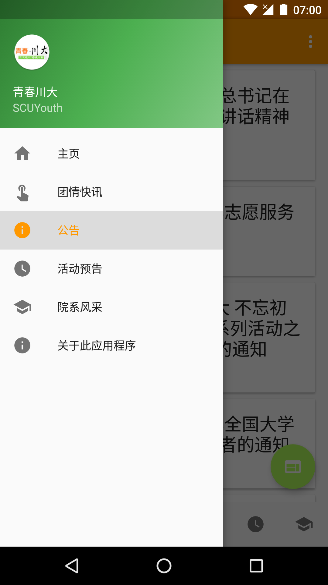

# SCUYouth
An Android web crawler example with Material Design navigation, lists, cards, and floating action buttons
## Introduction
SCUYouth is an Android application that fetches and displays information from the Youth League website of Sichuan Unversity in a gorgeous Material Design UI. Drawer navigation, bottom navigation and swipe navigation are combined to ease the navigation process. And lists and cards are used to display the information. This app was originally developed as the final assignment of the lesson Software Development Practices in Sichuan University, but can also serve as an example on how to implement navigation, lists, cards, and floating action buttons following Google's Material Design, and use the OkHttp and jsoup libraries to parse web pages on Android.
## Install the app
[Google Play]()<br>
[Wandoujia]()<br>
[Download APK](app/app-release.apk)
## Screenshots
     
## Proguard rules
If you build the application yourself, remember to include the following rules if you use Proguard.
```
# For OkHttp
-dontwarn okio.**
-dontwarn javax.annotation.Nullable
-dontwarn javax.annotation.ParametersAreNonnullByDefault

# For jsoup, non-official solution
-keeppackagenames org.jsoup.nodes
```
## License
Copyright 2017 Yongshun Ye

Licensed under the Apache License, Version 2.0 (the "License");
you may not use this file except in compliance with the License.
You may obtain a copy of the License at

    http://www.apache.org/licenses/LICENSE-2.0

Unless required by applicable law or agreed to in writing, software
distributed under the License is distributed on an "AS IS" BASIS,
WITHOUT WARRANTIES OR CONDITIONS OF ANY KIND, either express or implied.
See the License for the specific language governing permissions and
limitations under the License.
